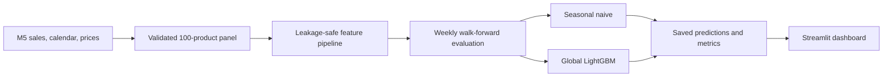
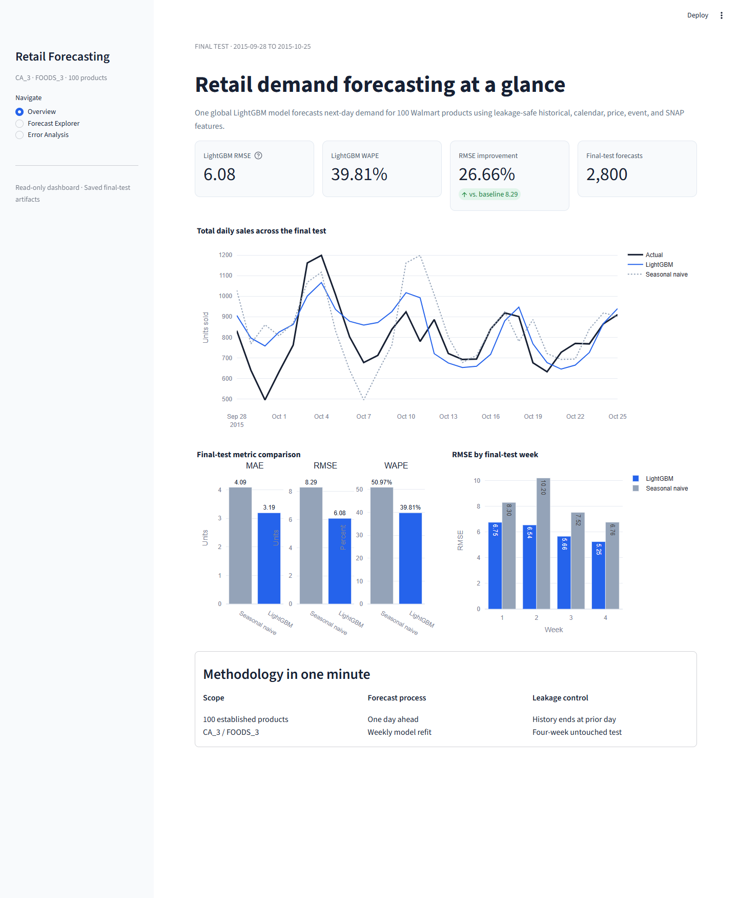
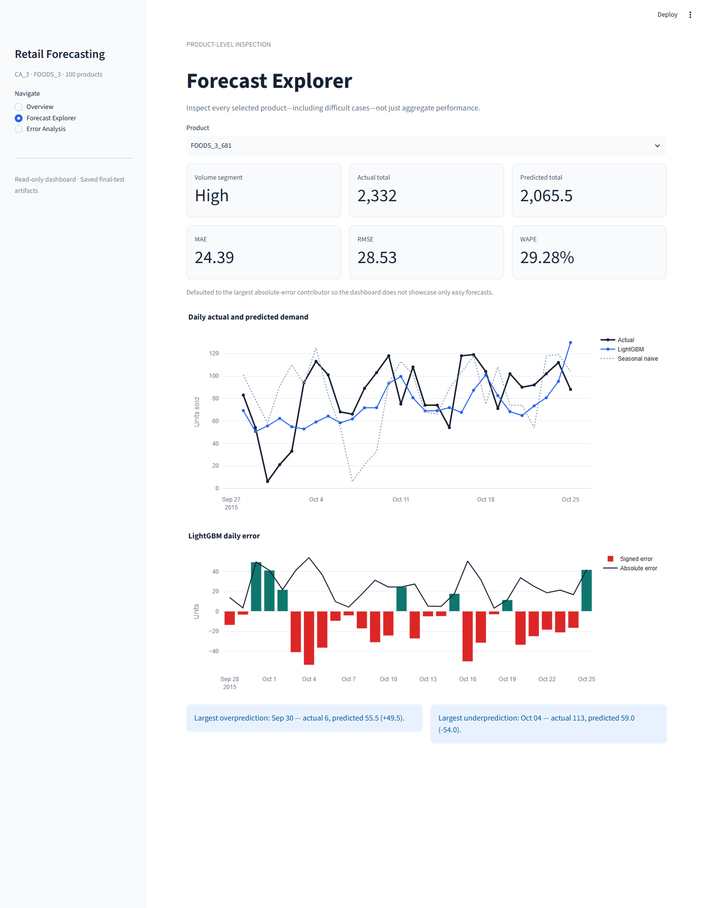
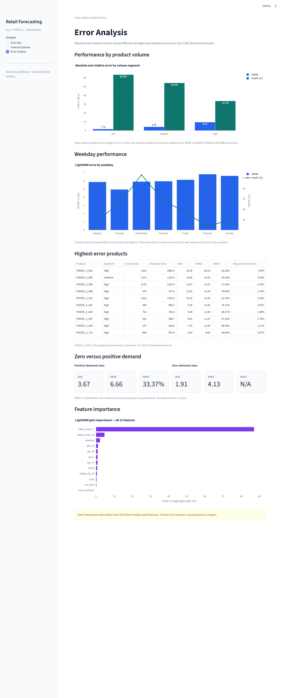

# Retail Sales Forecasting & Performance Dashboard

An end-to-end forecasting portfolio project that predicts next-day demand for 100 Walmart M5 products and turns final-test results into an interactive, decision-focused dashboard.

## Business Problem

Retail demand is intermittent, seasonal, and uneven across products. This project asks whether a global machine-learning model can improve one-day-ahead forecasts over a transparent weekly baseline—and where its errors still matter. The scoped case study covers `CA_3 / FOODS_3`, with one forecast per product per day.

## Project Highlights

- 173,100 product-days spanning 2011-01-29 through 2015-10-25
- Leakage-safe lag and shifted rolling features using sales only through the prior day
- Chronological validation followed by one untouched four-week final test
- One global LightGBM model compared with a seven-day seasonal-naive benchmark
- 2,800 final-test forecasts across 100 products
- 26.66% lower final-test RMSE than seasonal naive
- Three-page, artifact-only Streamlit dashboard with no retraining at launch

## Architecture



The analytical pipeline owns data validation, feature creation, model fitting, and evaluation. The dashboard reads only compact saved artifacts, which keeps presentation deterministic and prevents accidental training during page loads.

## Dataset

The project uses the public [M5 Forecasting Accuracy](https://www.kaggle.com/competitions/m5-forecasting-accuracy) data. To keep the case study auditable and fast, it filters to 100 established `FOODS_3` products sold at store `CA_3` before reshaping the wide sales history.

Source CSVs are intentionally Git-ignored. See [data access instructions](data/README.md) and the [data quality and EDA report](docs/data_quality_and_eda.md).

## Methodology

Each row predicts sales for product `i` on day `t`. Known day-`t` calendar, price, event, and SNAP fields are allowed; demand-derived features end at `t-1`.

The model uses 12 features: product ID, weekday, month, SNAP, event indicator, sell price, lags at 7/14/28 days, and shifted 7-day mean, 28-day mean, and 28-day standard deviation. The benchmark predicts demand from seven days earlier.

Time splits are strictly chronological:

- Development: through 2015-08-30
- Validation: 2015-08-31 through 2015-09-27
- Final test: 2015-09-28 through 2015-10-25

LightGBM was selected on validation RMSE before the final test was scored. Both models were then evaluated with weekly walk-forward refits.

## Features

| Group | Features | Availability rule |
|---|---|---|
| Identity | `item_id` | Known |
| Calendar | `weekday`, `month` | Known for target day |
| Exogenous | `snap`, `event_indicator`, `sell_price` | Known for target day |
| Demand lags | `lag_7`, `lag_14`, `lag_28` | Historical sales only |
| Rolling demand | `rolling_mean_7`, `rolling_mean_28`, `rolling_std_28` | Shifted one day before rolling |

## Results

On the untouched 2,800-row final test:

| Model | MAE | RMSE | WAPE |
|---|---:|---:|---:|
| Seasonal naive | 4.0893 | 8.2942 | 50.97% |
| **LightGBM** | **3.1939** | **6.0829** | **39.81%** |
| Relative improvement | **21.90%** | **26.66%** | **21.90%** |

LightGBM beat the seasonal-naive RMSE in every final-test week. MAE describes a typical unit miss, RMSE emphasizes large misses, and WAPE scales total absolute error by total demand.

## Error Analysis

Performance is not uniform. High-volume products dominate error measured in units, while low-volume products have the highest relative error. `FOODS_3_681` is the largest absolute-error contributor, accounting for 7.64% of all LightGBM absolute error. Tuesday has the lowest RMSE and Saturday the highest in this four-week test window; these patterns are descriptive, not causal.

Zero-demand rows are reported separately because their WAPE denominator is zero. Feature gain importance is also descriptive—it shows how the fitted model used inputs, not their causal business impact. See the full [LightGBM evaluation report](docs/lightgbm_and_evaluation.md).

## Dashboard

The app has exactly three pages:

1. **Overview** — headline metrics, aggregate actual-versus-predicted demand, model comparison, and weekly RMSE.
2. **Forecast Explorer** — all 100 products, defaulting to the highest-error product, with daily forecasts and signed errors.
3. **Error Analysis** — diagnostics by product volume, weekday, demand status, individual product, and all 12 feature importances.







## Repository Structure

```text
app/                         Streamlit pages, artifact loading, and Plotly charts
data/raw/                    Local M5 source files (Git-ignored)
data/processed/              Generated analytical tables (Git-ignored)
docs/                        Design, findings, screenshots, and resume bullets
outputs/                     Generated EDA/model artifacts (Git-ignored)
src/retail_forecasting/      Pipeline, features, baseline, model, and evaluation
tests/                       Data, leakage, metric, model, and dashboard tests
requirements.txt             Python dependencies
```

## Reproduction

Python 3.11+ is recommended. Download the M5 `calendar.csv`, `sell_prices.csv`, and `sales_train_evaluation.csv` files into `data/raw/`, then run:

```powershell
python -m venv .venv
.\.venv\Scripts\Activate.ps1
python -m pip install -r requirements.txt
$env:PYTHONPATH = "src"
python -m retail_forecasting.data_pipeline
python -m retail_forecasting.baseline
python -m retail_forecasting.evaluation
python -m unittest discover -s tests -v
streamlit run app/app.py
```

The ordered pipeline generates the Git-ignored inputs consumed by the dashboard. If artifacts are missing, Streamlit shows a setup message and does not train a model.

## Limitations

- The analysis covers one store/category slice and 100 established products, not the full M5 hierarchy.
- The task is rolling one-day-ahead forecasting; it does not evaluate multi-step recursive forecasts.
- Recorded sales may differ from unconstrained customer demand because stock availability is not modeled.
- Target-date scheduled selling price is assumed known at forecast time.
- Only one fixed LightGBM specification is compared with one strong, transparent baseline.
- The project does not model uncertainty, stockouts, cannibalization, promotions beyond available fields, or inventory decisions.
- Error slices cover four final-test weeks and should not be generalized as causal effects.
- Results come from retrospective evaluation; no production deployment or live performance claim is made.

## Tech Stack

Python, pandas, NumPy, LightGBM, Streamlit, Matplotlib, Plotly, Parquet/PyArrow, Git, and `unittest`.

Evidence-backed wording for portfolio use is available in [resume bullets](docs/resume_bullets.md).
